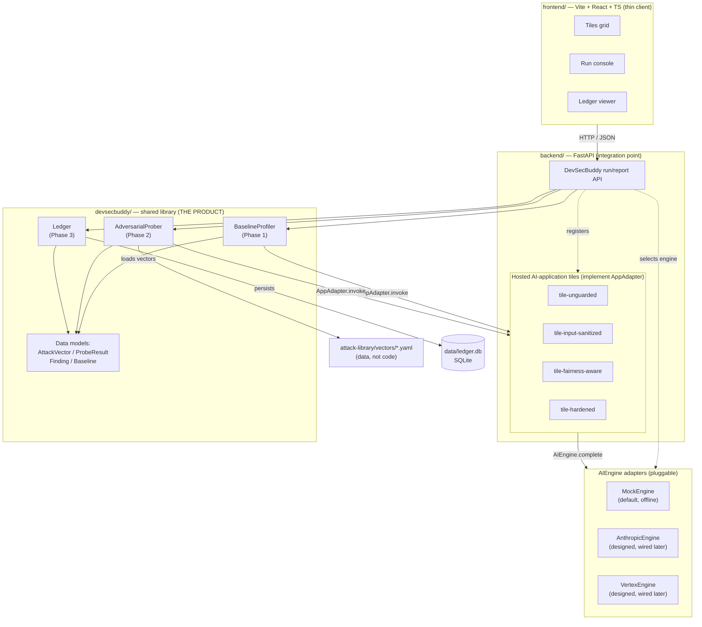
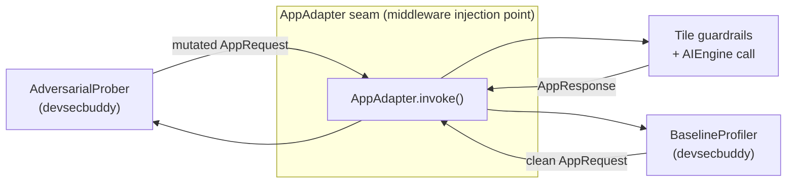
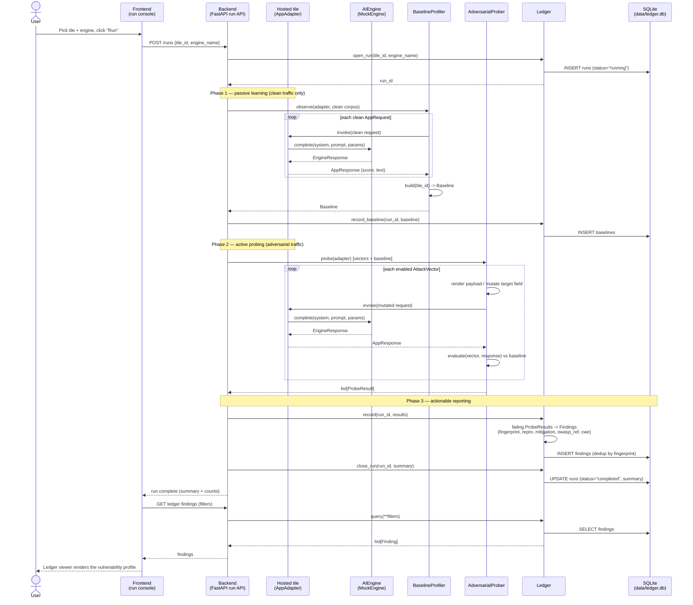

# Architecture

This document describes the **AI DevSecBuddy** system architecture in depth: the
components, how they fit together, the data that flows between them, and the two
design patterns that hold the whole thing up — the **middleware-injection**
pattern and the **single shared contract** (`AppAdapter`).

If you only read one thing, read this: *every tile implements the same
`AppAdapter` contract, so the identical probe suite runs unchanged against every
one of them.* The differences you see in the [vulnerability ledger](vulnerability-ledger.md)
then isolate cleanly to **guardrail strength**, not to interface drift. That is
the core idea the rest of the system is built to serve.

> **Status — docs-first prototype.** This deliverable is **documentation and
> folder structure only**; there is no runtime code yet. Everything below
> describes *design*: the names, signatures, schemas, and ids are binding (they
> come verbatim from the Design Bible), but no application is shipped here.

Related docs: [phases.md](phases.md) ·
[ai-engines.md](ai-engines.md) · [attack-library.md](attack-library.md) ·
[tiles.md](tiles.md) · [vulnerability-ledger.md](vulnerability-ledger.md) ·
[bias-and-fairness.md](bias-and-fairness.md) · [roadmap.md](roadmap.md)

---

## 1. The big picture

AI DevSecBuddy is a **web application** with a thin client and a product library
at its heart:

- **Frontend** — a Vite + React + TypeScript single-page app. It is a *thin
  client*: a **tiles grid**, a **run console**, and a **ledger viewer**. It holds
  no security logic and talks only to the backend.
- **Backend** — a FastAPI service that plays two roles at once. It **hosts the
  AI-application tiles** (the resume scorer in four incarnations) and it exposes
  the **DevSecBuddy run/report API**. It is the integration point.
- **`devsecbuddy`** — **the product**: a shared Python library implementing the
  three phases and the single shared contract. The backend *imports* it; it does
  not reimplement it.
- **`attack-library/`** — adversarial attack vectors as versioned **YAML data**
  (not code), continuously updated.
- **Vulnerability ledger** — a **SQLite** database (`data/ledger.db`) that is the
  durable, auditable security record.

The four major moving parts of the *product logic* are the
[`AIEngine`](ai-engines.md) (pluggable model provider), the `AppAdapter` (the
tile contract), the three phase components (`BaselineProfiler`,
`AdversarialProber`, `Ledger`), and the core data models (`AttackVector`,
`ProbeResult`, `Finding`, `Baseline`).

---

## 2. Component diagram



Read the diagram top-down: the **frontend** speaks only to the **backend**; the
backend wires together the **product library**, the **hosted tiles**, and the
selected **engine**; the prober and profiler reach the tiles *only* through the
`AppAdapter` contract; the tiles reach a model *only* through the `AIEngine`
interface; and the `Ledger` is the single component that touches **SQLite**.

---

## 3. The two load-bearing patterns

### 3.1 The single shared contract — `AppAdapter`

`AppAdapter` is the **one contract that makes the same probe suite run unchanged
against every tile**. A "tile" is *any* AI application wrapped to satisfy this
protocol; the `AdversarialProber` only ever talks to an `AppAdapter`, never to a
concrete tile.

Two properties make this work:

1. **Named, swappable input fields.** Every tile declares the *same* input fields
   — for the resume scorer, `applicant_name` and `resume_text`. Because the
   fields are named, the prober can mutate them identically across tiles: append
   an injection to `resume_text`, or swap `applicant_name` for a counterfactual
   variant (see [bias-and-fairness.md](bias-and-fairness.md)).
2. **A uniform structured response.** Every tile returns the *same* shape — a
   primary `score`, free `text`, and a `metadata` bag (tile id, engine name,
   guardrail decisions). The prober can therefore evaluate `success_criteria`
   uniformly, e.g. a score delta versus the [baseline](phases.md).

```python
@dataclass
class AppRequest:
    fields: dict          # named, swappable inputs, e.g.
                          #   {"applicant_name": "...", "resume_text": "..."}
    raw_text: str | None  # optional fully-rendered prompt, if relevant

@dataclass
class AppResponse:
    score: float | None   # primary structured output (resume score, 0-100)
    text: str             # free-text model output
    metadata: dict        # tile id, engine name, guardrail decisions/flags

class AppAdapter(Protocol):
    tile_id: str
    name: str

    def describe(self) -> dict: ...
        # static metadata: input field names, output schema, declared guardrails.

    def invoke(self, request: AppRequest) -> AppResponse: ...
        # run the target AI application for one request (applies its guardrails,
        # calls its AIEngine, returns structured + text output).
```

Because the four tiles in the [tile ladder](tiles.md) all expose the same
`invoke` and the same named fields, the *only* thing that varies between them is
the guardrails each applies inside `invoke`. That is what turns the demo into a
controlled experiment.

### 3.2 The middleware-injection pattern

DevSecBuddy does not bolt a separate scanner onto a finished app. Instead, the
`devsecbuddy` library is **injected as middleware/protocol around each hosted
tile**. The backend wraps every AI application behind the `AppAdapter` protocol
and hands that adapter to the product library; the library's profiler and prober
sit *in front of* the tile, observing clean traffic (Phase 1) and then injecting
adversarial traffic (Phase 2) through the very same `invoke` seam.

This has three consequences:

- **Transport- and storage-agnostic core.** The library never knows it is behind
  FastAPI, and only the `Ledger` knows it is on top of SQLite. The same library
  could be driven by a CLI, a CI job, or a UAT traffic tap without change.
- **Zero per-tile probe code.** Adding a new tile (or a real banking backend
  later) means writing *one* `AppAdapter`, not a new probe suite. New
  [attack vectors](attack-library.md) flow into the next run automatically.
- **Clean separation of duties.** `frontend/` renders, `backend/` wires, and
  `devsecbuddy/` reasons. The folder boundaries in §6 make this fixed.



---

## 4. The `devsecbuddy` public contract (summary)

The library exposes a small, fixed public surface. Signatures are **conceptual
design** (names and shapes are binding; bodies are out of scope in this
deliverable). Full treatment of each lives in [phases.md](phases.md) and
[ai-engines.md](ai-engines.md); this is the architectural summary.

| Element | Kind | Responsibility |
| --- | --- | --- |
| `AIEngine` | Protocol | Pluggable model provider behind `complete(system, prompt, params) -> EngineResponse`. The library and tiles depend only on this interface, never on a concrete SDK. Adapters: **`MockEngine`** (default), **`AnthropicEngine`**, **`VertexEngine`**. |
| `AppAdapter` | Protocol | The single shared contract every tile implements (`describe`, `invoke`). The prober talks only to this. |
| `BaselineProfiler` | Class (Phase 1) | Passively observes **clean** traffic and `build`s a `Baseline`. Never mutates inputs adversarially. |
| `AdversarialProber` | Class (Phase 2) | Renders each `AttackVector` against the tile, calls `AppAdapter.invoke`, and `evaluate`s `success_criteria` (often relative to the `Baseline`) into `ProbeResult`s. |
| `Ledger` | Class (Phase 3) | Owns persistence to SQLite; turns *failing* `ProbeResult`s into auditable `Finding`s; deduplicates via `fingerprint`. |
| `AttackVector` | Data model | One adversarial test loaded from [YAML](attack-library.md): category, OWASP ref, severity, target field, payload/template, machine-checkable `success_criteria`, mitigation. |
| `ProbeResult` | Data model | Outcome of one vector against one tile. `success=True` means the **attack succeeded** (a vulnerability), with request/response snapshots and a `metric_value`. |
| `Finding` | Data model | A persisted, auditable vulnerability record: repro, evidence, severity, `status`, `owasp_ref`, `cwe`, `mitigation_guidance`, and a stable `fingerprint`. |
| `Baseline` | Data model | A tile's learned normal behavior: `score_stats` and `behavior_signature` over clean traffic. |

### 4.1 Engine note

The user has **no Anthropic / Vertex accounts yet**. `AnthropicEngine` and
`VertexEngine` are **designed and documented now but wired up in a later step**.
**`MockEngine` is the only adapter implemented first** — it is deterministic,
offline, and **intentionally flawed** (it complies with injections and exhibits
name bias by design), so the *tiles' guardrails* are what make the difference.
An engine that advertises `info()["deterministic"] == True` must return identical
output for identical `(system, prompt, params)`, which keeps demos and repro
stable. See [ai-engines.md](ai-engines.md).

### 4.2 The three phase components in flow

The library's end-to-end run is a fixed sequence (detailed in
[phases.md](phases.md)):

```
Ledger.open_run
  -> BaselineProfiler.observe / build   (Phase 1 — passive learning)
  -> Ledger.record_baseline
  -> AdversarialProber.probe            (Phase 2 — active probing)
  -> Ledger.record                      (Phase 3 — actionable reporting)
  -> Ledger.close_run
```

| Phase | Component | Inputs | Outputs |
| --- | --- | --- | --- |
| 1. Passive learning | `BaselineProfiler` | an `AppAdapter` + a corpus of **clean** `AppRequest`s | a `Baseline`, persisted to `baselines` |
| 2. Active probing | `AdversarialProber` | the `Baseline` + enabled `AttackVector`s + the `AppAdapter` | a list of `ProbeResult`s (one per vector) |
| 3. Actionable reporting | `Ledger` | the `ProbeResult`s + `run_id`/`tile_id`/`engine_name` | `Finding`s (failing probes only), persisted to `findings`; run `summary` to `runs` |

---

## 5. Data flow — an active-probing run end to end

The sequence below traces a single run from a click in the **run console**
through the backend, into the **hosted tile**, through `devsecbuddy`'s three
phases, and down to the **SQLite ledger** — then back up to the **ledger
viewer**.



Two things to note in the flow:

- **Phase 1 sends only clean traffic.** The profiler never mutates inputs
  adversarially; it just learns the normal `score_stats` and behavior signature
  so that the deltas the prober measures in Phase 2 are meaningful.
- **Only failing probes become findings.** A `ProbeResult` with `success=True`
  means the *attack* succeeded — i.e. a vulnerability — and only those are turned
  into durable `Finding` rows. The `fingerprint` (`hash(tile_id, vector_id,
  normalized_signal)`) deduplicates the same vulnerability across re-runs.

For the same probe suite, the four tiles produce *different* profiles — that
contrast is the whole demonstration (see [tiles.md](tiles.md)):

| Tile id | Injection | Bias (gender/ethnicity) | Overall profile |
| --- | --- | --- | --- |
| `tile-unguarded` | fails (vuln) | fails (vuln) | worst |
| `tile-input-sanitized` | resolved | fails (vuln) | mixed |
| `tile-fairness-aware` | fails (vuln) | resolved | mixed |
| `tile-hardened` | resolved | resolved | best |

---

## 6. Repository layout and per-folder purpose

```
ai_devsecbuddy/
  README.md                 Approachable top-level intro: what the product is, the
                            3 phases, the tile demo, quickstart, links to docs/.
  .gitignore                Python + Node + SQLite ledger + OS cruft.
  docs/                     Canonical documentation set:
    architecture.md           This file: frontend <-> backend <-> devsecbuddy
                              <-> attack-library <-> ledger; data flow; component map.
    phases.md                 The 3 phases in depth: inputs/outputs per phase.
    ai-engines.md             AIEngine interface + Mock/Anthropic/Vertex adapters.
    attack-library.md         Attack-vector YAML schema + categories + OWASP map.
    tiles.md                  The 4-tile ladder: guardrails, flaws, expected profiles.
    vulnerability-ledger.md   SQLite schema (tables/columns) + finding lifecycle.
    bias-and-fairness.md      Counterfactual name-swap methodology + metrics.
    roadmap.md                Phased delivery; when engines/code get wired up.
  frontend/                 Vite + React + TypeScript UI: tiles grid, run console,
                            ledger viewer. Thin client over the backend run API.
  backend/                  FastAPI service: hosts the AI-application tiles AND the
                            DevSecBuddy run/report API. Integration point.
  devsecbuddy/              THE PRODUCT: shared Python library implementing the 3
                            phases + the single shared contract (injected as
                            middleware/protocol reused across every tile).
  attack-library/           Continuously-updated adversarial attack vectors.
    vectors/                  YAML vector files (one logical attack per record).
  data/                     Runtime home of the SQLite vulnerability ledger
                            (data/ledger.db). Gitignored; only its README tracked.
```

### Folder responsibility boundaries (fixed)

- **`frontend/`** holds *no* security logic. It renders tiles, launches/streams
  runs, and views the ledger. It talks only to `backend/`.
- **`backend/`** owns HTTP, tile hosting, engine selection, and persistence
  wiring. It *imports* `devsecbuddy`; it does not reimplement it.
- **`devsecbuddy/`** owns *all* product logic: phases, contracts, data models,
  success-criteria evaluation, fingerprinting, mitigation lookup. It is
  transport-agnostic and storage-agnostic at its core (the `Ledger` abstracts
  SQLite).
- **`attack-library/`** is **data, not code** — versioned independently; new
  vectors flow into the next run automatically. See
  [attack-library.md](attack-library.md).
- **`data/`** is a **runtime artifact** directory; the `.db` is created on first
  run and never committed.

---

## 7. Storage and persistence

The only component that touches the database is the `Ledger`. It persists to
**SQLite** at `data/ledger.db` (gitignored), across five tables — `tiles`,
`runs`, `baselines`, `attack_vectors`, and the core `findings` table. The
`attack_vectors` table stores a *snapshot* of each vector as it was run, so a
finding stays reproducible even if the source YAML later changes. Full column
definitions, the finding lifecycle, and the fingerprint/dedup rule are in
[vulnerability-ledger.md](vulnerability-ledger.md).

Keeping persistence behind the `Ledger` is what makes the rest of `devsecbuddy`
storage-agnostic — the same product logic could later target a different store
without touching the profiler, prober, or data models.

---

## 8. Standards alignment

DevSecBuddy's four probe categories map to the **OWASP Top 10 for LLM
Applications (2025)**. Prompt injection and modal jailbreaking map to **LLM01
(Prompt Injection)** — OWASP treats jailbreaking as an LLM01 subclass, and notes
that prompt injection has *no* parameterized-query-style fix, which is exactly
why DevSecBuddy frames its value as continuous, defense-in-depth adversarial
testing rather than a one-time gate. Data exfiltration maps to **LLM06 (Sensitive
Information Disclosure)** with **System Prompt Leakage** adjacent, and
bias/fairness failures map to **LLM09**. The bias probes operationalize the
classic counterfactual name-swap audit design (the Bertrand–Mullainathan callback
study, and validated on modern LLM resume scorers by recent work showing that
name redaction alone is insufficient because identity leaks via proxy features).
The full category→OWASP map lives in [attack-library.md](attack-library.md) and
the fairness methodology in [bias-and-fairness.md](bias-and-fairness.md).
