# AI DevSecBuddy — Build Roadmap

This roadmap describes how **AI DevSecBuddy** is delivered, **docs-first**. We
have already written the canonical documentation and folder structure; from here
we implement the product in thin, demonstrable slices.

The guiding principles:

- **Docs-first.** Every name, schema, and contract is fixed in the
  [Design Bible](../README.md) and its child docs *before* any code is written,
  so implementation has no ambiguity to resolve.
- **`MockEngine` first.** The default engine is deterministic, offline, and
  intentionally flawed. `AnthropicEngine` and `VertexEngine` are **designed and
  documented now, wired up later** — the user has no Anthropic or Vertex accounts
  yet (see [ai-engines.md](ai-engines.md)).
- **Vertical slice early.** We get one tile (`tile-unguarded`) running
  end-to-end — backend, frontend, ledger — before broadening to the full tile
  ladder and attack library.
- **Auditable from the start.** Every run writes to the SQLite vulnerability
  ledger so findings are reproducible and reviewable
  (see [vulnerability-ledger.md](vulnerability-ledger.md)).

> Status legend: ✅ done · 🚧 in progress · ⬜ not started

---

## Milestone checklist

| # | Milestone | Scope summary | Key deliverables | Engine | Status |
| --- | --- | --- | --- | --- | --- |
| **M0** | **Structure + README + docs** | Canonical repo layout, top-level README, and the full `docs/` set derived from the Design Bible. | `README.md`, `docs/architecture.md`, `docs/phases.md`, `docs/ai-engines.md`, `docs/attack-library.md`, `docs/tiles.md`, `docs/vulnerability-ledger.md`, `docs/bias-and-fairness.md`, `docs/roadmap.md`; folder skeleton (`frontend/`, `backend/`, `devsecbuddy/`, `attack-library/`, `data/`). | n/a | ✅ done |
| **M1** | **`devsecbuddy` contract + `MockEngine` + SQLite ledger** | Implement the product's core: the public contract, the default engine, and persistence. | `AIEngine` / `AppAdapter` protocols; data models (`AttackVector`, `ProbeResult`, `Finding`, `Baseline`); `BaselineProfiler`, `AdversarialProber`, `Ledger`; `MockEngine`; SQLite schema bootstrap for `data/ledger.db`. | `MockEngine` | ✅ done |
| **M2** | **FastAPI backend + unguarded tile + run API** | Stand up the backend that hosts a tile and exposes the DevSecBuddy run/report API. | `tile-unguarded` as an `AppAdapter`; FastAPI run/report endpoints; engine selection (Mock default); ledger wiring. | `MockEngine` | ✅ done |
| **M3** | **Frontend vertical slice** | Vite + React + TypeScript UI proving the loop end-to-end on the one tile. | Tiles grid, run console (launch/stream a run), ledger viewer — all against `tile-unguarded`. | `MockEngine` | ✅ done |
| **M4** | **Remaining tiles** | Complete the four-tile ladder so the same probe suite differentiates guardrail strength. | `tile-input-sanitized`, `tile-fairness-aware`, `tile-hardened` as `AppAdapter`s; tiles grid shows all four. | `MockEngine` | ✅ done |
| **M5** | **Full attack library + bias metrics** | Broaden coverage to the full vector set and fairness measurement. | `attack-library/vectors/*.yaml` across all four categories; counterfactual name-swap probes + bias metrics (score-delta, disparate-impact). | `MockEngine` | ✅ done |
| **M6** | **Wire `AnthropicEngine`, then `VertexEngine`** | Connect the real model adapters behind the existing `AIEngine` interface. **Requires external account setup (see below).** | `AnthropicEngine` (Claude) wired first, then `VertexEngine` (Google Vertex AI); engine picker in UI/run API. | `AnthropicEngine` → `VertexEngine` | 🚧 in progress |
| **M7** | **Passive-learning / baseline phase vs. real UAT capture** | Exercise Phase 1 against real test-environment traffic instead of a synthetic corpus. | `BaselineProfiler` fed by a captured UAT request/response corpus; persisted `Baseline`s; deltas computed against real baselines. | per target | ⬜ not started |
| **M8** | **Polish, reporting, export** | Production-readiness for the demo: usability and auditable output. | Run summaries and severity rollups; ledger export (e.g. report download); UI polish; docs refresh. | any | ⬜ not started |

---

## Delivery flow

```mermaid
graph LR
    M0["M0 · Structure + docs ✅"] --> M1["M1 · devsecbuddy contract<br/>+ MockEngine + ledger ✅"]
    M1 --> M2["M2 · FastAPI backend<br/>+ unguarded tile + run API ✅"]
    M2 --> M3["M3 · Frontend slice<br/>tiles grid · run console · ledger viewer ✅"]
    M3 --> M4["M4 · Remaining tiles ✅"]
    M4 --> M5["M5 · Full attack library<br/>+ bias metrics ✅"]
    M5 --> M6["M6 · AnthropicEngine<br/>then VertexEngine 🔑"]
    M6 --> M7["M7 · Passive learning<br/>vs. real UAT capture"]
    M7 --> M8["M8 · Polish · reporting · export"]

    style M0 fill:#cdeccd,stroke:#2d6a2d
    style M1 fill:#cdeccd,stroke:#2d6a2d
    style M2 fill:#cdeccd,stroke:#2d6a2d
    style M3 fill:#cdeccd,stroke:#2d6a2d
    style M4 fill:#cdeccd,stroke:#2d6a2d
    style M5 fill:#cdeccd,stroke:#2d6a2d
    style M6 fill:#ffe8b3,stroke:#b37700
```

The **vertical slice** spans M1 → M3: by the end of M3 a developer can pick the
`tile-unguarded` tile, launch a DevSecBuddy run powered by `MockEngine`, watch it
in the run console, and inspect the resulting findings in the ledger viewer. M4
onward broadens that proven loop rather than rebuilding it.

---

## Milestone detail

### M0 — Structure + README + docs ✅

The canonical folder layout, an approachable top-level `README.md`, and the full
documentation set are in place, all derived verbatim from the Design Bible. This
is the foundation every later milestone implements against. See
[architecture.md](architecture.md) for the component map and
[phases.md](phases.md) for the three-phase model.

### M1 — `devsecbuddy` contract + `MockEngine` + SQLite ledger ✅

Implement the product library in `devsecbuddy/`:

- the **`AIEngine`** and **`AppAdapter`** protocols (the single shared contract);
- the core data models — **`AttackVector`**, **`ProbeResult`**, **`Finding`**,
  **`Baseline`**;
- the three phase components — **`BaselineProfiler`** (Phase 1),
  **`AdversarialProber`** (Phase 2), **`Ledger`** (Phase 3);
- **`MockEngine`**, the deterministic, offline, intentionally-flawed default
  engine that complies with injections and exhibits name bias by design;
- the SQLite schema bootstrap for `data/ledger.db`
  (tables: `tiles`, `runs`, `baselines`, `attack_vectors`, `findings`).

Because `MockEngine` is deterministic, the whole loop is reproducible from this
point forward — a prerequisite for stable demos. See
[ai-engines.md](ai-engines.md) and
[vulnerability-ledger.md](vulnerability-ledger.md).

**Status: implemented.** The [`../devsecbuddy/`](../devsecbuddy/) package ships the
`AppAdapter` / `AIEngine` contracts, the data models, the three phase components,
the deterministic `MockEngine` (with `AnthropicEngine` / `VertexEngine` stubs for
M6), the five-table SQLite ledger, four reference tiles, and a CLI
(`python -m devsecbuddy --tile all`). A pytest suite asserts the
[tiles.md](tiles.md) divergence table and run reproducibility. See
[`../devsecbuddy/README.md`](../devsecbuddy/README.md) for the module map and
quickstart.

### M2 — FastAPI backend with the unguarded tile + run API ✅

Stand up `backend/` as the integration point: host the first tile,
`tile-unguarded`, wrapped behind `AppAdapter`, and expose the DevSecBuddy
run/report API. The backend selects the engine (Mock by default), drives the
end-to-end run (`open_run` → baseline → probe → record → `close_run`), and wires
persistence. The backend *imports* `devsecbuddy`; it never reimplements product
logic. See [tiles.md](tiles.md) and [architecture.md](architecture.md).

**Status: implemented.** [`../backend/`](../backend/) is a FastAPI service that
hosts the four reference tiles behind `AppAdapter` and exposes the run/report API
(`/tiles`, `/engines`, `POST /runs`, `/runs/{id}`, `/findings`), with env-driven
engine selection (`MockEngine` default; an unconfigured cloud engine returns HTTP 503).
A `POST /runs` drives the full `open_run → baseline → probe → record → close_run`
flow and returns the run summary + findings; 8 API tests pass. Runs are
synchronous for now — live streaming arrives with the M3 frontend. Run it with
`uvicorn backend.main:app`; see [`../backend/README.md`](../backend/README.md).

### M3 — Frontend tiles grid + run console + ledger viewer (vertical slice) ✅

Build the `frontend/` Vite + React + TypeScript client as a thin layer over the
backend run API, proving the full loop on the single `tile-unguarded` tile:

- **tiles grid** — list available tiles and launch a run;
- **run console** — start and stream a run's progress;
- **ledger viewer** — browse the findings that the run produced.

This is the vertical slice: a complete, demonstrable path from tile selection to
auditable findings.

**Status: implemented.** [`../frontend/`](../frontend/) is a Vite + React +
TypeScript SPA (`src/api.ts` typed client, `App.tsx` shell, and the `TilesGrid` /
`RunConsole` / `LedgerViewer` / `FindingDetail` components) that builds clean
(`tsc --noEmit` + `vite build`). It is a thin client over the M2 API — no security
or engine logic. The run console animates the three phases while the (synchronous)
run is in flight; real streaming is future polish. Run it with
`npm --prefix frontend run dev` against a running `uvicorn backend.main:app`; see
[`../frontend/README.md`](../frontend/README.md).

### M4 — Add the remaining tiles ✅

Add the other three incarnations of the resume scorer so the four-tile ladder is
complete: `tile-input-sanitized`, `tile-fairness-aware`, and `tile-hardened`.
The **same** probe suite runs against all four; their differing vulnerability
profiles demonstrate the payoff of guardrail strength. See [tiles.md](tiles.md)
for each tile's guardrails, known flaws, and expected profile.

**Status: implemented (delivered alongside M1–M3).** All four tiles were built as
`AppAdapter`s in `devsecbuddy/demo.py` during M1 (the divergence test asserts their
distinct profiles), the M2 backend exposes all four via `GET /tiles` and `POST
/runs`, and the M3 frontend grid renders all four. No further work is required for
this milestone.

### M5 — Full attack library + bias metrics ✅

Populate `attack-library/vectors/` with the full vector set across all four
categories (`prompt_injection`, `modal_jailbreak`, `data_exfiltration`,
`bias_fairness`) and implement the fairness measurement methodology:
counterfactual name-swap probes (hold the resume fixed, vary only the applicant
name across demographic axes, measure the score delta) plus the supporting
metrics. Audits report multiple metrics rather than a single verdict, because
common fairness criteria are mathematically incompatible in general. See
[attack-library.md](attack-library.md) and
[bias-and-fairness.md](bias-and-fairness.md).

**Status: implemented.** The library now spans all four categories
(`attack-library/vectors/` — 6 enabled vectors driving the demo plus 3 staged
`enabled: false` vectors for real-engine techniques), and the fairness suite —
mean/max delta, demographic-parity gap, disparate-impact (four-fifths) ratio, and
flip rate — is computed by [`../devsecbuddy/fairness.py`](../devsecbuddy/fairness.py)
and recorded in every `bias_fairness` finding's evidence. The four-tile divergence
now covers `prompt_injection`, `modal_jailbreak`, `data_exfiltration`, and
`bias_fairness` (`tile-unguarded` → 6 findings, `tile-hardened` → 0); 31 tests pass.

### M6 — Wire `AnthropicEngine`, then `VertexEngine` 🚧 🔑 requires external setup

> **⚠️ This milestone has an external dependency the user must satisfy first.**
> The `AnthropicEngine` and `VertexEngine` adapters are *designed and documented*
> today behind the `AIEngine` interface, but they cannot be wired up until real
> credentials exist. Specifically, M6 **requires the user to**:
>
> 1. **Set up an Anthropic API key** (for `AnthropicEngine` — Claude); and
> 2. **Set up a GCP / Vertex AI project** with appropriate access (for
>    `VertexEngine` — Google Vertex AI).
>
> These are **follow-on prerequisites**, not part of the docs-only deliverable.
> Until they are in place, `MockEngine` remains the default and only runnable
> engine. We wire `AnthropicEngine` first, then `VertexEngine`.

Once credentials are available, each adapter slots in behind the unchanged
`AIEngine` interface, and the engine picker in the run API / UI gains the new
options. Note that real engines are **non-deterministic**, so repro depends on
captured evidence in the ledger rather than on identical re-runs. See
[ai-engines.md](ai-engines.md).

**Status: `AnthropicEngine` live-validated (🚧 Vertex pending GCP).** Both adapters
are coded, share one Messages-API mapping, and are unit-tested with a mocked SDK;
they run **Claude Haiku 4.5** by default. **`AnthropicEngine` has been validated
against the live model:** a real run on `tile-unguarded` surfaced a genuine
system-prompt / rubric-leak finding (`data_exfiltration`, LLM06) — while the model
itself **resisted the injection and jailbreak probes and showed no significant name
bias** — and `tile-hardened` came back **clean**, so the guardrail ladder holds on a
real model too. `VertexEngine` (Claude on Vertex) still needs the user's GCP
project + credentials. Signup walkthroughs:
[anthropic-signup.md](setup/anthropic-signup.md),
[google-vertex-signup.md](setup/google-vertex-signup.md). Until an engine is
configured, `GET /engines` reports `configured: false` and a run returns HTTP 503.

### M7 — Passive-learning / baseline phase vs. real UAT capture ⬜

Exercise Phase 1 against real traffic. Instead of a synthetic clean corpus, feed
`BaselineProfiler` a request/response capture from a real test environment (e.g.
UAT) so the learned `Baseline` reflects the target application's actual normal
behavior. Adversarial score deltas in Phase 2 are then measured against that
real-world baseline, sharpening the findings. This realizes the **shift-left**
promise: profiling and probing in test, before production. See
[phases.md](phases.md).

### M8 — Polish, reporting, export ⬜

Final readiness pass for the demo and for platform/security audiences:

- run summaries and severity/category rollups surfaced in the UI;
- ledger **export** for auditable, shareable security records;
- usability polish across the tiles grid, run console, and ledger viewer;
- a documentation refresh to match the shipped behavior.

---

## Immediate next follow-on prompts

**M0–M5 are complete** (the docs + structure; the `devsecbuddy` core; the FastAPI
backend + run/report API; the React frontend vertical slice; the full four-tile
ladder; and the broadened attack library + fairness metrics). The next prompts:

1. **Finish M6 (🚧 in progress).** The adapters are coded + mock-tested; what remains
   is **account setup** — an **Anthropic API key** and a **GCP / Vertex AI project**
   (walkthroughs in [docs/setup/](setup/)) — then a **live smoke test** against real
   models. (The staged `enabled: false` vectors activate here.)
2. **M7 — passive learning vs. a real UAT capture.** Feed `BaselineProfiler` a real
   request/response capture instead of the synthetic clean corpus — see
   [phases.md](phases.md).

---

## Related documentation

| Doc | What it covers |
| --- | --- |
| [README.md](../README.md) | Product intro, the three phases, the tile demo, quickstart. |
| [architecture.md](architecture.md) | System architecture and component map. |
| [phases.md](phases.md) | The three phases in depth (inputs/outputs). |
| [ai-engines.md](ai-engines.md) | `AIEngine` interface and the Mock/Anthropic/Vertex adapters. |
| [attack-library.md](attack-library.md) | Attack-vector YAML schema, categories, and OWASP map. |
| [tiles.md](tiles.md) | The four-tile ladder: guardrails, flaws, expected profiles. |
| [vulnerability-ledger.md](vulnerability-ledger.md) | SQLite schema and finding lifecycle. |
| [bias-and-fairness.md](bias-and-fairness.md) | Counterfactual name-swap methodology and metrics. |
