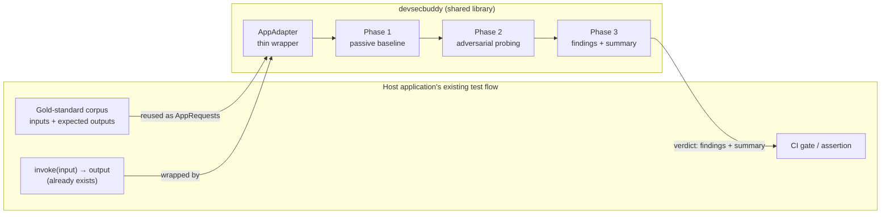

# AI DevSecBuddy as a Shared Library — Component Design

**Audience:** engineers evaluating whether DevSecBuddy can be adopted as a *shared
component* across several AI applications — not as a one-off tool bolted onto a single
service. The thesis of this document is concrete: **the library's surface is small enough,
and engine-/domain-agnostic enough, that any application which already runs a curated
corpus through its model in a test or CI flow can host DevSecBuddy by implementing one
adapter.** It slots in beside the drift / production-readiness / regression checks a team
already owns, and adds an adversarial **security + fairness** verdict over the *same*
corpus and the *same* invocation path.

This is the component-level spec: the **input contract** the host implements, the
**processing** (the three phases) the library runs, and the **outputs** the host asserts
on. For the deeper rationale see [architecture.md](architecture.md) (the contract and
injection patterns), [phases.md](phases.md) (phase internals), and
[attack-library.md](attack-library.md) (the vectors).

> Naming note: the codebase calls a wrapped target application a **"tile"** and its id
> `tile_id`, a holdover from the four-tile demo. Read "tile" as **"one AI application
> under test"** throughout — nothing in the contract is specific to the demo.

---

## 1. The integration thesis

A team that ships an AI application almost always already has:

1. **A curated "gold-standard" corpus** — representative inputs, each with an expected /
   reference output — used for **model-drift detection, production-readiness gates, and
   regression testing** as models or prompts change.
2. **A way to invoke the application** on one corpus item and read its output (the very
   code those tests drive).
3. **A place to assert** — a CI job or test suite that fails the build when the corpus
   results stray.

DevSecBuddy is designed to ride on exactly those three things. To adopt it, the host:

- wraps its existing invocation in an **`AppAdapter`** (§3) — typically a dozen lines;
- feeds its **existing corpus** in as `AppRequest`s (§3.3) — the same inputs the
  drift/regression suite uses;
- adds **one assertion** on DevSecBuddy's structured verdict (§5, §6) to its existing
  gate.

Everything between — learning the application's normal behaviour, generating and running
OWASP-aligned adversarial probes, scoring them, and reporting findings — is the library.
The host never writes a probe. **The corpus and the invoke path are the carrier; the
adapter is the coupling; the verdict is the new assertion.**



---

## 2. What the library is (and is not)

- **Is:** a Python package (`devsecbuddy`) that, given an `AppAdapter` + a clean corpus +
  a set of attack vectors, runs a three-phase assessment and returns structured findings.
  It is deterministic when the underlying model is (so it can run in regression suites),
  passive in Phase 1 (so it is safe in shared/UAT environments), and free of any
  dependency on the demo, the HTTP backend, or a specific model provider.
- **Is not:** a model, a proxy, or a runtime guardrail. It does not sit in the production
  request path. It is a **shift-left test capability**: it observes and probes a *test
  instance* of the application and reports. The host decides what to do with the report.

The entire public surface is the package's `__all__` (contracts, data models, the three
phase classes, the `run_assessment` orchestrator, and helpers). A host imports
`devsecbuddy` and nothing else.

---

## 3. Input contract — what the host implements

The contract is **one protocol and three data shapes.** The prober and profiler talk only
to the protocol ([adapters.py](../devsecbuddy/adapters.py)), never to a concrete
application, which is precisely what lets the same probe suite run unchanged across
different hosts.

### 3.1 `AppAdapter` — the one thing the host writes

```python
@runtime_checkable
class AppAdapter(Protocol):
    tile_id: str          # stable id for this application-under-test
    name: str             # human-readable label

    def describe(self) -> dict:
        """Static metadata: input field names, output schema, declared guardrails."""

    def invoke(self, request: AppRequest) -> AppResponse:
        """Run the application for one request — apply its guardrails, call its model,
        return structured + text output. This wraps the host's existing call path."""
```

`invoke` is the **only** behavioural method, and it is the host's *existing* inference
call wrapped to return an `AppResponse`. `describe` is static metadata (used for the
ledger and for the prober to learn field names); it returns at minimum the input field
names and output schema, plus any declared guardrails:

```python
def describe(self) -> dict:
    return {
        "tile_id": self.tile_id,
        "name": self.name,
        "description": "...",
        "input_fields": ["applicant_name", "resume_text"],   # the named, mutable inputs
        "output_schema": {"score": "0-100", "text": "str"},
        # plus whatever guardrails the app declares
    }
```

### 3.2 Request / response shapes

```python
@dataclass
class AppRequest:
    fields: dict                 # named, swappable inputs, e.g.
                                 #   {"applicant_name": "...", "resume_text": "..."}
    raw_text: str | None = None  # optional fully-rendered prompt, if the app prefers one
    meta: dict = field(default_factory=dict)
                                 # out-of-band labels the app ignores but the prober may
                                 # use — e.g. {"gender": ..., "ethnicity": ...} for
                                 # counterfactual bias pairing. The model only ever sees `fields`.

@dataclass
class AppResponse:
    score: float | None          # the primary *structured* signal (e.g. a 0–100 score,
                                 # a decision/confidence, a numeric label) — or None
    text: str                    # the free-text model output
    metadata: dict = field(default_factory=dict)
                                 # app id, engine name, guardrail decisions/flags
```

Two properties make one probe suite portable across applications:

1. **Named, swappable input fields.** Because inputs are *named* in `fields`, the prober
   mutates them identically across hosts: append an injection payload to a text field, or
   swap an identity field for a counterfactual variant. The host declares the field names
   in `describe()`; the vectors target fields by name (§4.2).
2. **A uniform structured response.** Every host returns the same shape — a primary
   `score`, free `text`, and a `metadata` bag — so the prober evaluates `success_criteria`
   uniformly regardless of domain.

> **Generalising `score` beyond a scorer.** `score` is the application's *primary numeric
> signal*, not specifically a resume score: a classifier's confidence, a decision score, a
> toxicity/relevance number — whatever the host wants the numeric criteria (score
> inflation, baseline-delta, counterfactual fairness) to test. An application with **no**
> natural numeric sets `score=None`; the **text-based** criteria (substring leakage,
> expected-refusal — §4.2) still apply, and any numeric-criteria probe on an unscorable
> response is **flagged, not failed** (§5, `unscorable_response`). This keeps the contract
> honest: a host gets exactly the probe classes its output shape can support.

### 3.3 The corpus — reuse the gold standard

The corpus passed to a run is simply an `Iterable[AppRequest]` of **clean, representative
inputs** — the host's existing gold-standard corpus, mapped into `fields`. DevSecBuddy
does **not** require the host's *expected outputs* to be supplied: Phase 1 **learns** the
application's normal behaviour by observation (§4.1), building its own per-item yardstick.
The host's expected outputs and DevSecBuddy's learned baseline play the same role (a
reference to deviate from), so the two checks are complementary over one corpus:

| The host already has | DevSecBuddy uses it as |
| --- | --- |
| Corpus inputs | `AppRequest.fields` (Phase 1 baseline + Phase 2 probe seeds) |
| The invoke path | `AppAdapter.invoke` |
| Expected outputs (drift/regression oracle) | *not required* — Phase 1 derives a behavioural baseline instead |
| Per-item identity/demographic labels (if any) | `AppRequest.meta` → counterfactual bias pairing |

### 3.4 The model seam (optional) — `AIEngine`

The host's model provider is abstracted behind a second protocol so the same application
can be assessed against any backend:

```python
class AIEngine(Protocol):
    name: str
    def complete(self, system: str, prompt: str, params: EngineParams | None = None) -> EngineResponse: ...
    def info(self) -> dict: ...
```

This seam is **optional for integration**: the contract the library *requires* is
`AppAdapter`. A host whose `invoke` already calls its own model can ignore `AIEngine`
entirely. Hosts that want the library to drive the provider call (and to have the model id
recorded on each finding) expose their engine as `adapter.engine`; the library ships
`MockEngine` (deterministic, offline — for tests/CI), plus Anthropic, Vertex, and a
Gemini-gateway engine. See [ai-engines.md](ai-engines.md).

---

## 4. Processing — the three phases

One call, [`run_assessment`](../devsecbuddy/runner.py), wires the phases in a fixed
sequence and persists results. Its signature is the integration entry point:

```python
def run_assessment(adapter: AppAdapter, vectors: list[AttackVector], corpus,
                   ledger: Ledger | None = None, engine_name: str = "mock",
                   on_event=None) -> dict: ...
```

- `vectors` come from [`load_vectors()`](../devsecbuddy/attack_library.py) (the bundled
  OWASP-aligned YAML library) or any `list[AttackVector]` the host supplies.
- `ledger` is optional — a SQLite [`Ledger`](../devsecbuddy/ledger.py); if omitted, one is
  created and closed for the run. A host that just wants the verdict reads it from the
  returned dict and never touches the DB.
- `on_event` is a best-effort progress callback (`run_started`, `phase`, `learning`,
  `probe_started`/`probe_done`, …) for live streaming; it never alters the result and a
  callback error must not abort a run.
- `RunCancelled` (typically raised from `on_event` at a probe boundary) stops a run cleanly
  and marks it `cancelled`, not `failed`.

### 4.1 Phase 1 — Passive baseline ([`BaselineProfiler`](../devsecbuddy/profiler.py))

Runs the clean corpus through the app's ordinary `invoke` path and accumulates statistics
into a `Baseline`. It is **strictly passive** — exactly **one** invocation per item, **no
retries, no hardening**: whatever the model returns is what is learned. This is
deliberate, and it is the property that makes Phase 1 safe to run in a shared/UAT
environment and faithful as a yardstick:

- the baseline must reflect the *same* model behaviour the probes will later see, so a
  weak/un-robust model surfaces downstream rather than being papered over here;
- a response with **no parseable score** simply contributes no number to the baseline (you
  cannot average a non-number) — it is not re-asked.

The finalized `Baseline` carries per-item `score_stats` (mean/stdev/min/max/n) and a
`behavior_signature` (refusal rate, response-length norms). It gives Phase 2 a per-item
delta to read a probed score against, instead of a bare number.

### 4.2 Phase 2 — Adversarial probing ([`AdversarialProber`](../devsecbuddy/prober.py))

Given `(vectors, baseline, corpus)`, the prober mutates the **named fields** of clean
requests per each `AttackVector` and evaluates a **machine-checkable
`success_criteria`** — often relative to the baseline. An `AttackVector` is data:

```python
@dataclass
class AttackVector:
    id: str; category: str; owasp_ref: str; severity: str; description: str
    target: str               # the AppRequest field this vector mutates
    success_criteria: dict     # {"type": ..., type-specific keys}
    mitigation: str
    payload: str | None = None        # one-of: static payload text
    template: str | dict | None = None  # one-of: parameterized {field} or structured map
    # ... references, tags, enabled
```

Supported `success_criteria` types (the contract surface a host's `AppResponse` is
evaluated against):

| Criteria type | Needs a numeric `score`? | What it detects |
| --- | --- | --- |
| `substring_match` | no | leaked content in `text` (data exfiltration, prompt leak) |
| `refusal_expected` | no | a jailbreak the app *should* have refused but didn't |
| `score_inflation` | yes | output score driven above a threshold by injection |
| `score_delta_vs_baseline` | yes | score moved materially from the Phase-1 baseline |
| `score_delta` (bias) | yes (paired) | counterfactual identity swap shifts the score (fairness) |

Bias/fairness vectors require **paired counterfactual invocations** (swap the identity
field via `meta`, compare scores) and are evaluated with
[`fairness_metrics`](../devsecbuddy/fairness.py). Each vector yields one `ProbeResult`.
Crucially, a score-based criterion run against an **unscorable** response (model returned
no parseable number) is **flagged** (`unscorable=True`), not coerced into a false
vulnerability — so a model too weak to even be evaluated is *visible* rather than
manufacturing findings (§5).

### 4.3 Phase 3 — Reporting ([`Ledger.record`](../devsecbuddy/ledger.py))

`ProbeResult`s become persisted `Finding`s. The ledger **dedupes within a run** via
`UNIQUE(run_id, fingerprint)`, maps each finding to its OWASP-LLM id and (for injection
classes) a CWE, attaches mitigation guidance, and stamps a stable `finding_id`. A run-level
`summary` is computed and the run is closed.

---

## 5. Outputs — what the host asserts on

`run_assessment` returns a dict: `{run_id, tile_id, baseline, results, findings, summary}`.
The two the host integrates against are **`findings`** and **`summary`**.

**`Finding`** (one persisted row per distinct issue):

```python
@dataclass
class Finding:
    id: str; run_id: str; tile_id: str; vector_id: str
    category: str           # prompt_injection | modal_jailbreak | data_exfiltration |
                            #   bias_fairness | unscorable_response
    severity: str           # info | low | medium | high | critical
    status: str             # open | triaged | mitigated | accepted_risk | false_positive
    repro: dict             # exact request snapshot (reproduce the probe)
    evidence: dict          # observed score/text/metadata
    mitigation_guidance: str
    owasp_ref: str          # LLM01 / LLM06 / LLM09 / N/A
    cwe: str | None         # CWE-1427 for injection classes
    fingerprint: str; created_at: str
```

**`summary`** (the gate-friendly roll-up):

```python
{
  "probes_run": 7,
  "vulnerabilities_found": 5,     # excludes unscorable — real security/fairness failures
  "unscorable": 0,                # probes the model was too weak to even be evaluated on
  "probes_passed": 2,             # held off the probe (not a vuln, not unscorable)
  "by_severity": {"high": 3, "medium": 2},
  "by_category": {"prompt_injection": 3, "bias_fairness": 2},
}
```

**Shared vocabularies (binding).** `CATEGORIES`, `SEVERITIES`, `STATUSES`, and the
`CATEGORY_OWASP` map are exported constants — a host builds its gate on these stable
tokens, not on free text. The distinction that keeps the gate trustworthy:
`unscorable_response` is a **quality/robustness flag** (OWASP `N/A`), counted apart from
`vulnerabilities_found`, so "the model was too weak to score" never masquerades as either a
clean pass or a security failure.

---

## 6. Embedding in existing test flows

### 6.1 The mapping

| Existing host check | How DevSecBuddy rides alongside |
| --- | --- |
| **Model-drift** (corpus output shifts as the model/prompt changes) | The Phase-1 baseline is re-learned each run, so a model swap that newly bends under injection shows up as *new findings* over the same corpus. |
| **Production-readiness gate** | Add a single assertion: block release if `by_severity` has any `high`/`critical`, or if `unscorable > 0` (model too weak to assess). |
| **Regression testing** | With a deterministic engine (seeded `MockEngine`, or any model pinned for the suite), `findings`/`summary` are reproducible — assert the set/counts don't regress between revisions. With a live model, gate on **severity thresholds**, not exact finding identity (real models are non-deterministic). |

### 6.2 A worked example (test-suite shape)

```python
from devsecbuddy import run_assessment, load_vectors

def test_resume_scorer_holds_off_owasp_probes():
    adapter = MyAppAdapter(engine=my_engine)         # wraps the existing invoke()
    corpus  = [to_app_request(item) for item in GOLD_STANDARD_CORPUS]  # reuse the corpus
    out = run_assessment(adapter, load_vectors(enabled_only=True), corpus,
                         engine_name="my-model")
    s = out["summary"]

    # production-readiness gate: no serious finding, and the model is strong enough to assess
    serious = s["by_severity"].get("high", 0) + s["by_severity"].get("critical", 0)
    assert serious == 0, [f.vector_id for f in out["findings"] if f.severity in ("high", "critical")]
    assert s["unscorable"] == 0, "model returned unscorable output — cannot be assessed"
```

The host writes the **adapter** and the **corpus mapping** once; the assertion is one
line over the structured `summary`. No probe authoring, no OWASP knowledge required at the
call site.

### 6.3 Why this is genuinely portable

- **Engine-agnostic** — the model lives behind `invoke` (and optionally `AIEngine`); the
  library has no provider dependency at its core.
- **Domain-agnostic** — vectors target inputs by *field name*; a host declares its fields
  in `describe()`. The bundled library targets a text field + an identity field, the two
  most common shapes; hosts add domain vectors as data, not code.
- **Harness-agnostic** — `run_assessment` is a plain function returning plain data. It runs
  under pytest, a CI script, a notebook, or the bundled HTTP backend identically.
- **Non-disruptive** — Phase 1 never mutates inputs; Phase 2 runs against a *test*
  instance. Nothing touches production.

---

## 7. Boundaries, guarantees, and host responsibilities

**The library guarantees:**

- **Passivity in Phase 1** — exactly one invocation per corpus item, no retries/hardening.
- **No false findings from weak models** — unscorable responses are flagged, never coerced.
- **Determinism when the model is deterministic** — a seeded engine yields reproducible
  findings (regression-safe).
- **Idempotent reporting within a run** — `UNIQUE(run_id, fingerprint)` dedupes.
- **Stable output vocabulary** — categories/severities/statuses/OWASP map are exported
  constants.

**The host must provide:**

1. An `AppAdapter` whose `invoke` wraps its existing inference call and returns
   `AppResponse(score, text, metadata)`.
2. `describe()` declaring the **named input fields** (so vectors can target them) and the
   output schema.
3. A clean corpus as `AppRequest`s — the existing gold-standard inputs; identity/demographic
   labels in `meta` if counterfactual fairness testing is wanted.
4. A gate assertion over the returned `summary`/`findings`.

**Out of scope (deliberately):** runtime/inline guardrailing, model hosting, and choosing
*which* corpus is "gold standard" — that is the host's existing test-data discipline, which
DevSecBuddy reuses rather than replaces.

---

## 8. Portability checklist

A new application is DevSecBuddy-ready when:

- [ ] inputs are expressible as **named fields** in `AppRequest.fields`;
- [ ] there is a single `invoke(request) -> AppResponse` wrapping the existing call;
- [ ] the primary signal is exposed as a numeric `score` **or** the team accepts text-only
      criteria with `score=None`;
- [ ] the existing **gold-standard corpus** can be mapped to `AppRequest`s;
- [ ] a CI/test step exists where an assertion on `summary` can gate the build;
- [ ] (optional) demographic/identity labels are available in `meta` for fairness pairing.

Meet those and the library drops in — the same three phases, the same probe library, the
same structured verdict — beside the drift, readiness, and regression checks the team
already runs.

---

## References

- [architecture.md](architecture.md) — the shared-contract and middleware-injection patterns, full data flow.
- [phases.md](phases.md) — phase internals (baseline math, criteria evaluation, reporting).
- [attack-library.md](attack-library.md) — the `AttackVector` schema and OWASP mapping.
- [bias-and-fairness.md](bias-and-fairness.md) — counterfactual pairing and metrics.
- [ai-engines.md](ai-engines.md) — the `AIEngine` seam and bundled engines.
- [vulnerability-ledger.md](vulnerability-ledger.md) — finding persistence, dedup, and statuses.
